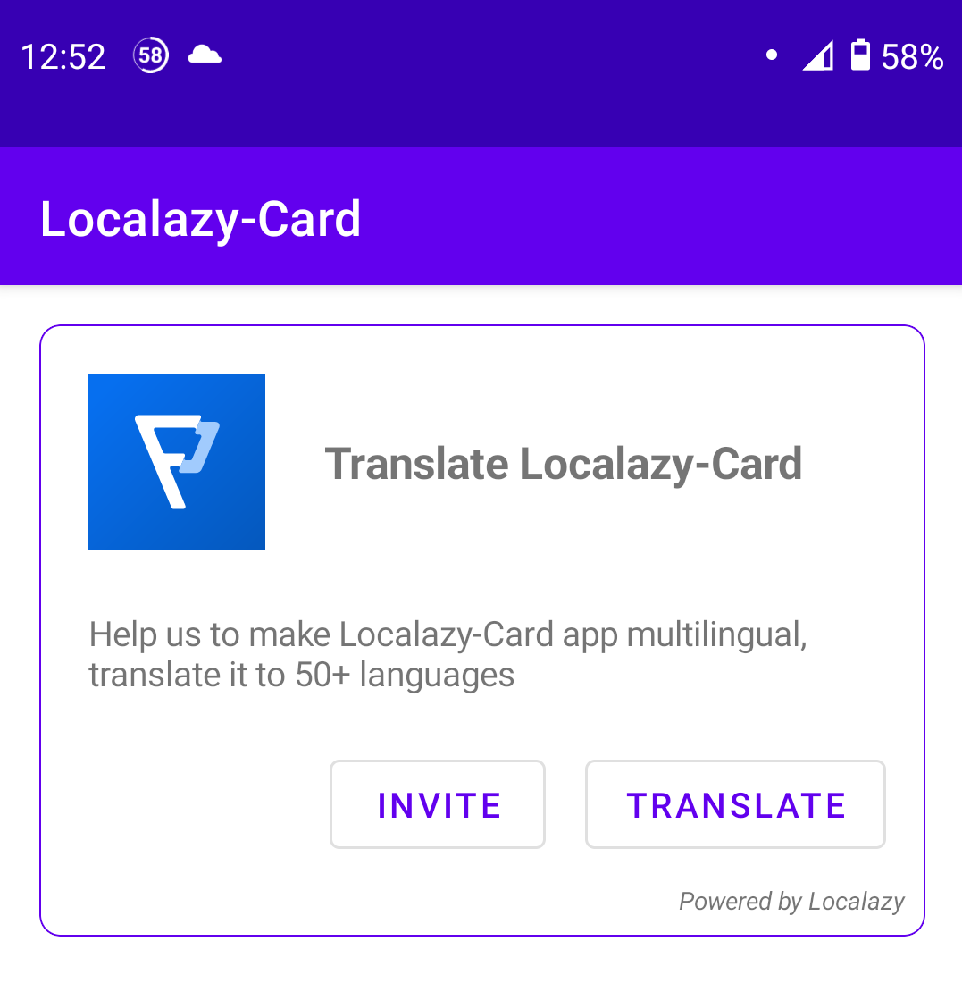

# Localazy-Card
[](https://www.gnu.org/licenses/gpl-3.0) 
[](https://hits.seeyoufarm.com)

This is a small library to help the developers who already using <a href="https://localazy.com">Localazy</a> to localize their apps, 
aside that library support app language changing directly from it



Add it in your root build.gradle at the end of repositories:

```
allprojects {
  repositories {
    ...
    maven { url 'https://jitpack.io' }
  }
}
```
  
Include the library as a local library project or add the dependency in your build.gradle.
```
dependencies {
        implementation 'com.github.Paget96:Localazy-Card:v1.0.3'
}
```

# Setup
By the default library will set a default view, you can easily manipulate it over xml or inside class.

### Step 1
Include the view defined as below in your layout. And you can customize it like this.
```
   <com.paget96.localazycard.LocalazyCard
        android:id="@+id/localazyCard"
        android:layout_width="match_parent"
        android:layout_height="wrap_content"
        android:layout_margin="16dp"
        app:localazy_app_translation_link="https://localazy.com"
        app:localazy_icon="@drawable/ic_localazy"
        app:localazy_invitation_message="@string/default_invitation_text"
        app:localazy_summary="@string/default_summary"
        app:localazy_title="@string/default_title" />
```

### Step 2
##### (Optional) Add this to your activity if you want language changer feature
```
@Override
protected void attachBaseContext(Context base) {
    super.attachBaseContext(LocaleUtils.onAttach(base));
}
```
#### Add this to the class which own the xml you set in Step 1
```
LocalazyCard localazyCard = findViewById(R.id.localazyCard);

// Optional - define what languages your app have
// this will be used for language changer
// IMPORTANT, define activity for language changing
localazyCard.setActivity(this);
localazyCard.setLanguages("en", "");
localazyCard.setLanguages("de", "");
localazyCard.setLanguages("fr", "");

// Set card icon
localazyCard.setIcon(R.drawable.ic_localazy);

// Title text
localazyCard.setTitle(getString(R.string.translate) + " " + getString(R.string.app_name));
localazyCard.setTitleTextSize(18f);
localazyCard.setTitleTextStyle(Typeface.BOLD);

// Summary text
localazyCard.setSummaryText(getString(R.string.summary_text, getString(R.string.app_name)));
localazyCard.setSummaryTextSize(14f);
localazyCard.setSummaryTextStyle(Typeface.NORMAL);

// Open translation link
localazyCard.setTranslateButton("https://localazy.com");

// Invite to translate
localazyCard.setInviteButton(this, getString(R.string.invitation_text, getString(R.string.app_name)) , "https://localazy.com");
```

### Step 3 (Strings)
Add this to your strings file (those are default strings if you use configuration from step 2, this can be changed)
```
<string name="app_name">Localazy-Card</string>

<string name="translate">Translate</string>
<string name="summary_text">Help us to make %1$s app multilingual, translate it to 50+ languages</string>
<string name="invitation_text">I\'m inviting you to help translating %1$s</string>
<string name="this_is_test_1">This is test 1</string>
<string name="this_is_test_2">This is test 2</string>
<string name="this_is_test_3">This is test 3</string>

```

### Step 4 (style)
Since this library is basically an extended view of a MaterialCardView, you can use pretty much the same features as the default material card have
```
localazyCard.setRadius(24); // Set card corner radius
localazyCard.setStrokeColor(ContextCompat.getColor(this, R.color.design_default_color_primary)); // Set stroke color
localazyCard.setStrokeWidth(2); // Set stroke width
localazyCard.setElevation(0f); // Set card elevation
// And much more
```

# Changelog
### 1.0.4 (20-Mar-2021)
- Added feature to change app language directly from the app
- Updated library code
- Exported strings

### 1.0.3 (20-Mar-2021)
- Added invitation button
- Slightly updated card view
- Updated app example

### 1.0.2 (19-Mar-2021)
- Added changing text size and style
